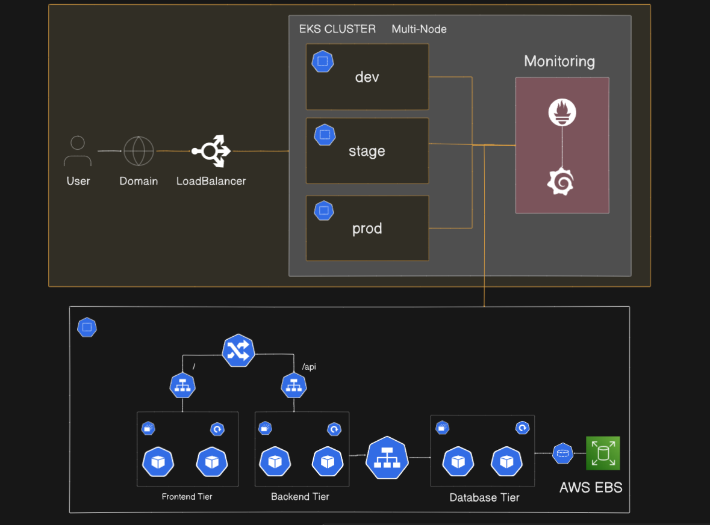

# **Multi Environment EKS Cluster with Monitoring**

## **Project Overview:**

This project demonstrates a robust Kubernetes setup on AWS EKS with multi-node clusters and multi-environment namespaces. It implements best practices like dynamic volume provisioning, rolling updates, and cluster monitoring.

## **Features:**

- **AWS EKS Multi-Node Cluster:** Scalable and highly available Kubernetes cluster on AWS.
- **Multi-Namespace Environment:** Separate namespaces for **`dev`**, **`staging`**, and **`prod`** environments.
- **MongoDB with EBS Volumes:** Persistent storage using AWS EBS for MongoDB data.
- **Dynamic Volume Provisioning:** Persistent Volumes created on-demand, waiting for consumer pods.
- **Rolling Updates Deployment Strategy:** Zero-downtime updates for deployments.
- **Cluster Monitoring:** Integrated monitoring with **Prometheus** and **Grafana** for metrics and alerts.

## **Architecture**


## **Prerequisites**

- AWS Account

_I will help you to setup this cluster even if you are a beginner_

## **Setup Instruction:**

### **Step 1 Lunch Bastion Host:**

- What is Bastion Host ?
  - The Server through we will control our Cluster, This EC2 will not be the part of our cluster
- Lunch `T2.micro`
- Update EC2 `sudo apt update`

### **Step 2 Install AWS CLI and Configure:**

- Install AWS CLI command

```
curl "https://awscli.amazonaws.com/awscli-exe-linux-x86_64.zip" -o "awscliv2.zip"
sudo apt install unzip
unzip awscliv2.zip
sudo ./aws/install
```

- Configure AWS
  - Go to AWS IAM and create User
  - create `Access Key` and `Secret Access Key`
  - Then use this command `AWS configure`
  - it will ask for your accesskey and sceret accesskey, copy past them
  - now your Bastion Host is configured with your AWS

### **Step 3 Install kubectl ,esksctl and Helm:**

- kubectl install command:

```
curl -o kubectl https://amazon-eks.s3.us-west-2.amazonaws.com/1.19.6/2021-01-05/bin/linux/amd64/kubectl
chmod +x ./kubectl
sudo mv ./kubectl /usr/local/bin
kubectl version --short --client
```

- eksctl install command

```
curl --silent --location "https://github.com/weaveworks/eksctl/releases/latest/download/eksctl_$(uname -s)_amd64.tar.gz" | tar xz -C /tmp
sudo mv /tmp/eksctl /usr/local/bin
eksctl version
```

- Helm install command

```
curl -fsSL -o get_helm.sh https://raw.githubusercontent.com/helm/helm/main/scripts/get-helm-3
chmod 700 get_helm.sh
./get_helm.sh
```

### **Step 4 Create Cluster:**

- Create EKS Cluster

```bash
eksctl create cluster --name=my-cluster \
                      --region=ap-south-1 \
                      --version=1.30 \
                      --without-nodegroup
```

- Associate IAM OIDC Provider

```bash
eksctl utils associate-iam-oidc-provider \
    --region ap-south-1 \
    --cluster my-cluster \
    --approve
```

#

- Create Nodegroup

```bash
eksctl create nodegroup --cluster=my-cluster \
                       --region=ap-south-1 \
                       --name=my-cluster \
                       --node-type=t2.medium \
                       --nodes=2 \
                       --nodes-min=2 \
                       --nodes-max=2 \
                       --node-volume-size=25 \
                       --ssh-access \
                       --ssh-public-key=ec2_keypair
```

#### Note: Make sure the ssh-public-key "ec2_keypair is available in your aws account"

#

- Update Kubectl Context

```bash
aws eks update-kubeconfig --region ap-south-1 --name my-cluster
```

#

- Delete EKS Cluster (Once you are done)

```bash
eksctl delete cluster --name=my-cluster --region=ap-south-1
```

### **Step 5 Install AWS EBS CSI Driver:**

- We are Installing AWS EBS CSI Driver because we are storing data in EBS, so that data is persisted across cluster
- Add the AWS EBS CSI Driver Helm chart repository:

```
helm repo add aws-ebs-csi-driver https://kubernetes-sigs.github.io/aws-ebs-csi-driver
helm repo update
```

- Identify Node Group IAM Role:

```
aws eks describe-nodegroup \
  --cluster-name <your-cluster-name> \
  --nodegroup-name <your-nodegroup-name> \
  --query "nodegroup.nodeRole" --output text

```

- this will written something like this
  `arn:aws:iam::123456789012:role/eksctl-my-cluster-nodegroup-NodeInstanceRole
`

- Attach IAM Policy for EBS CSI

```
aws iam attach-role-policy \
  --role-name <your-node-role-name> \
  --policy-arn arn:aws:iam::aws:policy/service-role/AmazonEBSCSIDriverPolicy
```

**Note:** Replace `your-node-role-name` with the actual IAM role name from previous step

- Install the EBS CSI Driver via Helm

```
helm install aws-ebs-csi-driver aws-ebs-csi-driver/helm install aws-ebs-csi-driver aws-ebs-csi-driver/aws-ebs-csi-driver \
  --namespace kube-system

```

- verify Installation
  `kubectl get pods -n kube-system | grep ebs
`

---

## **Now let's Deploy Appliation**

- You can deploy this with Helm and also without Helm
- Without Helm only one `NameSpace` i.e,`three-tier`
- With Helm multi `NameSpace` i.e, `dev`, `stagging`, `prod`

### **Without Helm:**

- Go to `k8s/` folder
- Apply all `yml` files one by one

```
kubectl apply -f namespace.yml
kubectl apply -f storageclass.yml
kubectl apply -f secret-mongo.yml
kubectl apply -f configmap.yml
kubectl apply -f headless-svc.yml
kubectl apply -f mongo-service.yml
kubectl apply -f mongo-deployment.yml
kubectl apply -f backend-statefullset.yml
kubectl apply -f backend-service.yml
kubectl apply -f frontend-deployment.yml
kubectl apply -f frontend-service.yml
kubectl apply -f ingress.yml
kubectl apply -f auto-scaler.yml
```

- **Initiating MongoDB Replica Set**
  - We do this so that MongoDB in Kubernetes knows it’s a replica set cluster.
  - Your backend (Mongoose) requires this to elect a PRIMARY and replicate data properly.
  - exec inside the `mongo-0` pod - `kubectl exec -it mongo-0 -n dev -- mongosh`
    ```bash
        rs.initiate({ 
          _id: "rs0",
          members: [
          { _id: 0, host: "mongo-0.mongo-headless.dev.svc.cluster.local:27017" },
          { _id: 1, host: "mongo-1.mongo-headless.dev.svc.cluster.local:27017" }
          ]
          })

        rs.status()

        use admin

        db.createUser({
          user: "admin",
          pwd: "mypassword",
          roles: [ { role: "root", db: "admin" }]
        })
    ```

- **Install Nginx Ingress Controller**
    - we are adding this because so that routing is done to apppropitate service
```bash
kubectl apply -f https://raw.githubusercontent.com/kubernetes/ingress-nginx/controller-v1.11.1/deploy/static/provider/aws/deploy.yaml
````

- **Get External IP of NGINX Ingress**

  ```bash
  kubectl get svc -n ingress-nginx
  nslookup <external-ip>
  ```

- **Update `/etc/hosts`**
  Add the following line to your `/etc/hosts` file:

```
<external-ip> your-app-domain.com
```

- **Access the Application**
  Open your browser and navigate to:

```
http://your-app-domain.com
```

---

### **With Helm**

- Go to `three-tier/` folder
- Use this command to apply all `yml` through Helm
- namespace `dev`
    ```bash
    helm install three-tier-dev . -f values-dev.yml -n dev --create-namespace
    ```
- namespace `stageing`
    ```bash
    helm upgrade --install three-tier-stage ./ \
  -f values-stage.yml \
  -n staging \
  --create-namespace
    ```
- namespace `prod`
    ```bash
    helm upgrade --install three-tier-prod ./ \
  -f values-prod.yml \
  -n prod \
  --create-namespace
    ```
- Initiate MongoDB Replica Set as mentioned in pervious steps for all `namespaces`(Refer previous steps)
- Install Nginx Ingress Controller and other steps (only once)

---

## **Monitoring with Prometheus and Grafana** 

- **Install kube-prometheus-stack**
  ```bash
  helm repo add prometheus-community https://prometheus-community.github.io/helm-charts
  helm repo update
  ```

- **Deploy the chart into a new namespace "monitoring"**
  ```bash
  kubectl create ns monitoring

  helm install monitoring prometheus-community/kube-prometheus-stack -n monitoring 
  ```

- **Verify the Installation**
  ```bash
  kubectl get all -n monitoring
  ```

- **Prometheus UI:**
  ```bash
    kubectl port-forward service/prometheus-operated -n monitoring 9090:9090
  ```
**NOTE:** If you are using an EC2 Instance or Cloud VM, you need to pass --address 0.0.0.0 to the above command. Then you can access the UI on instance-ip:port

- **Grafana UI:** password is `prom-operator`
  ```bash
  kubectl port-forward service/monitoring-grafana -n monitoring 8080:80
  ```
- Open ports of `Bastion Host` port: `9090`and `8080`
- Access Prometheus `<BastionHostIP>:9090`
- Access Grafana `<BastionHostIP>:8080`